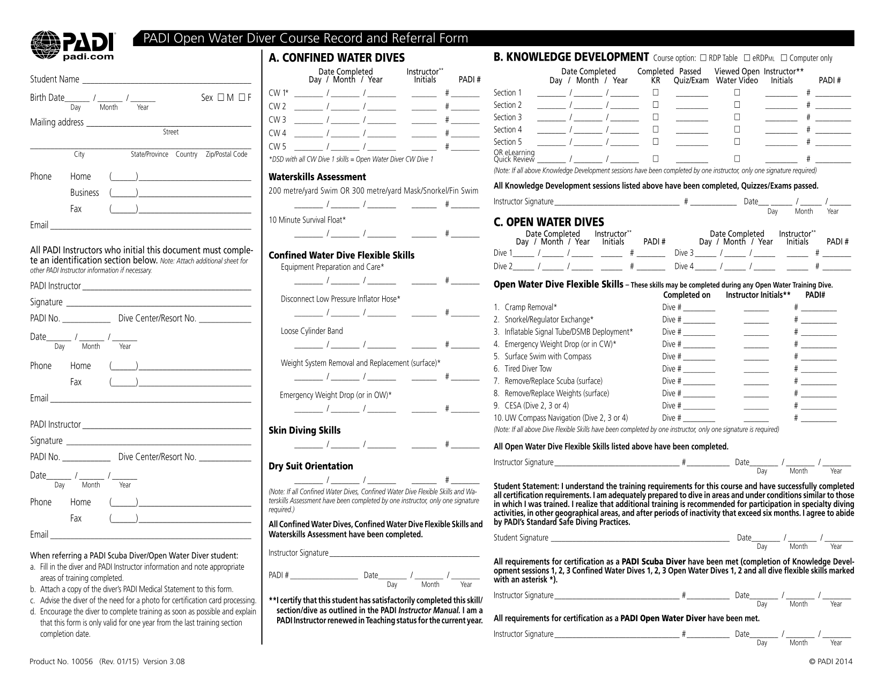
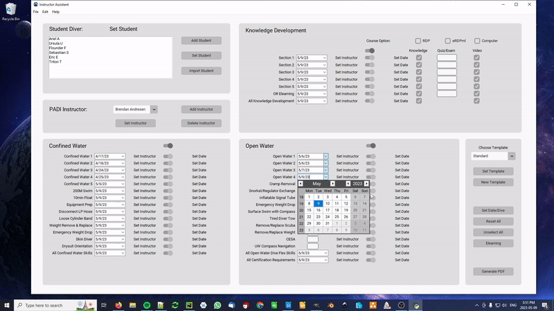
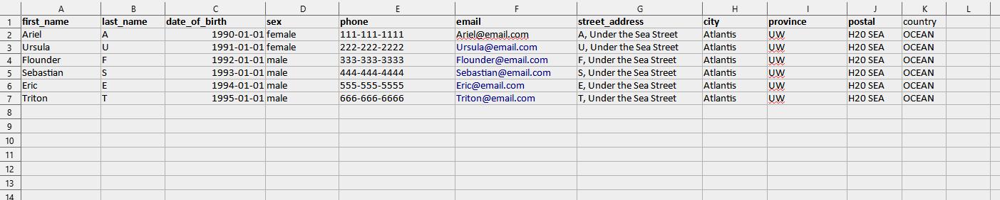

# Instructor Assistant App

A tool to help PADI Scuba Diving Instructors complete the 'Record and Referral' form.

<div align="center">

</div>
  

# Overview

"PADI® (Professional Association of Diving Instructors®) is the world’s largest ocean exploration and diver organization, operating in 186 countries and territories, with a global network of more than 6,600 dive centers and resorts and over 128,000 professional members worldwide. Issuing more than 1 million certifications each year, and with over 29 million certifications to date". https://www.padi.com/about/who-we-are

PADI Scuba Diving Instructors are required to complete the 'Record_and_Referral_Form' for every student after the PADI Open Water Course. The Instructor Assistant App aims to make that process fast and easy. By hand, completing the form takes approximately 8 - 10mins per student and 1 hour for a class of 6 students. With this tool Instructors will be able to complete paperwork for a full class in less then 5 minutes. 


# Description

### Save Instructor Details 

Add, delete and save your instructor details for future use.  After your password verification, the Instructor Assistant App will automatically complete the required fields.  Keep in mind you will still need to physically sign the Instructor signature fields afterwords.  

### Team Teaching Ready

The user interface allows you to easily toggle single or entire sections on or off.  Toggle off the Ocean Dive section with one click for Ocean Referrals for example.  Any item in the off position will be unaffected when the `Set Date/Dive` or `Set Instructor` button is clicked.  When team teaching, use this method to separate Instructor teaching assignments and produce a Record and Referral form with multiple Instructors.  

<br>
<br>
<div align="center">

</div>
<br>
<br>

### Use Dive Templates

Create and customize templates to complete even faster.  Each Instructor has a unique way of conducting the PADI Open Water Course and often repeats parts of the course schedule.  For example, for the Confined Water One dive an Instructor may also complete Knowledge Review Section One, 200m swim and the 10min float on the same day.  Dive Templates allow you to save these matching date pairs so you only need to complete the Confined Water One field date.  After pressing the "Set Template" button the subsequent date pairs will be updated.

### Import Student Information
The option to import bulk student information is available.  Currently the Instructor Assistant App supports imports from an excel file with the following column headings.

```
'first_name' 
'last_name'
'date_of_birth' 
'sex'
'phone' 
'email'
'street_address'
'city'
'province'
'postal'
'country'
```

For the `date_of_birth` column data can be in either a `datetime` or `string` format.  If using a string, format date *dd/mm/yyyy*.  
<br>
<br>
<div align="center">

</div>

:point_up: *Note: I deployed a python script when I managed a dive shop to parse customer data into a similar excel format from a wordpress woocommerce store.  The script ran daily and its purpose was to email students automatically with course information and promotional material leading up to, during and after the course. I hope to post in the future but please reach out to me if you are interested in something similar <brendan.development@pm.me>* :ok_hand:

    


  
