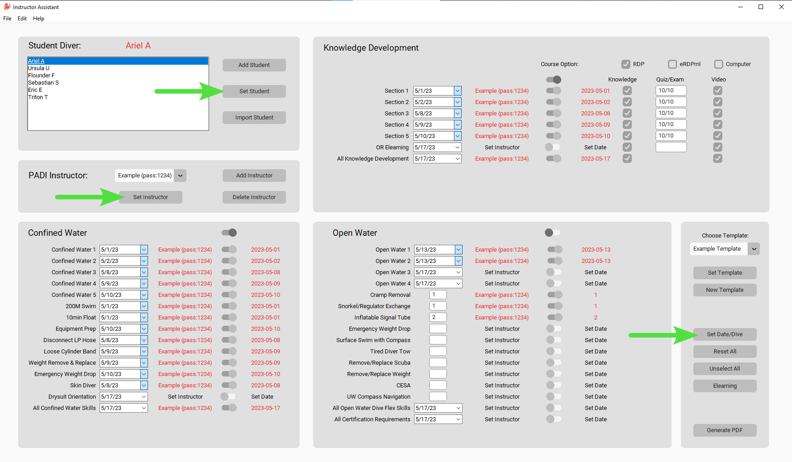
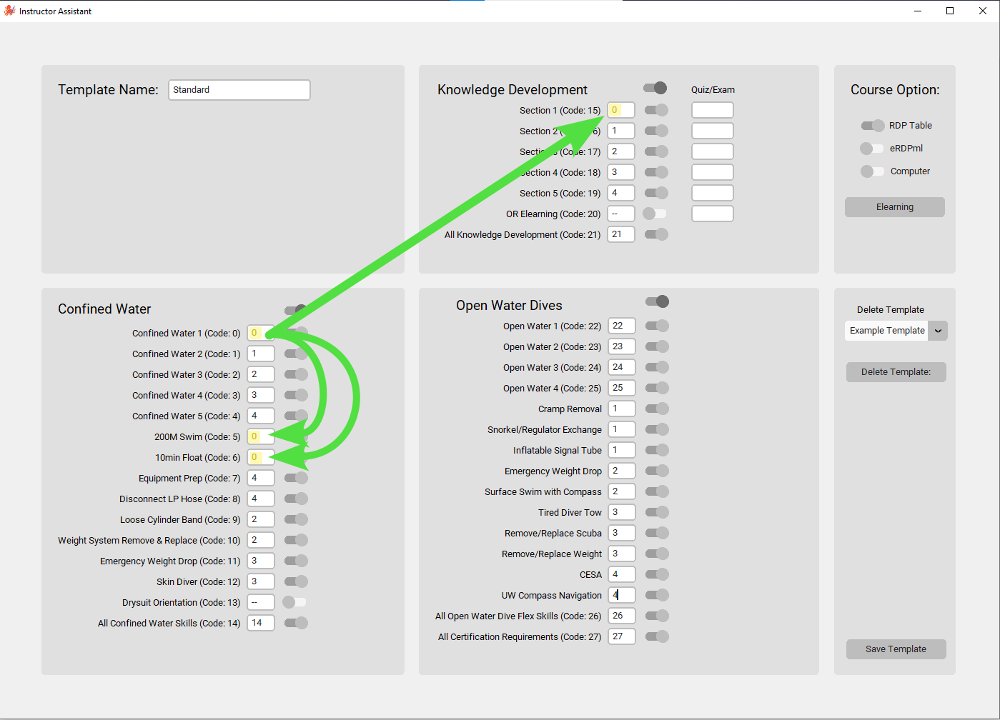

# Instructor Assistant  

A tool to help PADI Scuba Diving Instructors complete the 'Record_and_Referral_Form.pdf.

<div align="center">

</div>
  

# Overview

"PADI® (Professional Association of Diving Instructors®) is the world’s largest ocean exploration and diver organization, operating in 186 countries and territories, with a global network of more than 6,600 dive centers and resorts and over 128,000 professional members worldwide. Issuing more than 1 million certifications each year, and with over 29 million certifications to date". https://www.padi.com/about/who-we-are

PADI Scuba Diving Instructors are required to complete the 'Record_and_Referral_Form.pdf' for every student after the PADI Open Water Course. The Instructor's Assistant aims to make that process fast and easy. By hand, completing the form takes approximately 8 - 10mins per student and 1 hour for a class of 6 students. With this tool Instructors will be able to complete paperwork for a full class in less then 5 minutes. A typical dive shop conducting 120 Open Water Certificates a year would save two full work days worth of time. 


# Description

### Save Instructor Details 

Add, delete and save your instructor details for future use.  After your password verification, The Instructor's Assistant will automatically complete the required fields.  Keep in mind you will still need to physically sign the Instructor signature fields afterwords.  

### Team Teaching Ready

The user interface allows you to easily toggle single or entire sections on or off.  Toggle off the Ocean Dive section with one click for Ocean Referrals for example.  Any item in the off position will be unaffected when the `Set Date/Dive` or `Set Instructor` button is clicked.  When team teaching, use this method to separate Instructor teaching assignments and produce a Record and Referral form with multiple Instructors.  

<br>
<br>
<div align="center">

</div>
<br>
<br>

### Use Dive Templates

Create and customize templates to complete even faster.  Each Instructor has a unique way of conducting the PADI Open Water Course and often repeats parts of the course schedule.  For example, for the Confined Water One dive an Instructor may also complete Knowledge Review Section One, 200m swim and the 10min float on the same day.  Dive Templates allow you to save these matching date pairs so you only need to complete the Confined Water One field date.  After pressing the "Set Template" button the subsequent date pairs will be updated.

### Import Student Information
Save time and with the option to import bulk student information from a course roster excel file.  

# Getting Started

### Set Information
Use the `Set Student` `Set Instructor` and `Set Date/Dive` buttons to confirm selections prior to pressing the `Generate PDF` button.  The "Set" function will replace the stock text field with the desired text information in red.  The red text is an indication to the user what information will be added to the Student Record File and where.  To leave any field blank use the toggle button to turn the off desired section prior to using the Set function.

<br>
<div align="center">

</div>
<br>

### Choose PDF Save Path
By default the Student Record Files will be saved to the users desktop and generated every time the `Generate PDF` button is pressed.  To change the desired location select the Edit > Choose PDF Save Path Button to set a new save path. 


### Importing Student Information Format
Currently The Instructor's Assistant supports imports from an excel file with the following column headings.

```
'first_name' 
'last_name'
'date_of_birth' 
'sex'
'phone' 
'email'
'street_address'
'city'
'province'
'postal'
'country'
```

For the `date_of_birth` column data can be in either a `datetime` or `string` format.  If using a string, format date *dd/mm/yyyy*.  See "assets/openwater_diver_course_example_import.xlsx" for an example student import file.
<br>
<div align="center">

</div>

### Making a Dive Template
The purpose of a dive template is to make date-pairs for different skills completed on the same day.  Each skill with a date has a unique integer code (0 - 27). For example, Confined Water One's code is 0.  The user can set other skill boxes to 0 to make a date-pair with Confined Water One.  After saving and selecting the template on the Main UI the user can press the `Set Template` button and the program will read the date for Confined Water One and match each of the corresponding date-pairs.  Additionally, users can input Open Water Flexible Dive Completions, choose course options (rdp, erdpml, computer) or toggle any section they want to leave blank. 

<br>
<div align="center">

</div>

# Installation

### Windows Installer
On the Releases section of this repository there is a Windows Installer users can download.  Currently with version 0.1.0, this program is setup up to run on the local users directory and can be downloaded to `C:\Users\<username>\AppData\Local\instructor_assistant`.  A Desktop and Startmenu shortcut is included as well as an Uninstaller.  

_Note: The Windows Installer doesn't have a Windows Publisher's Certificate which may prompt warnings during install about an unknown publisher.  Included on the Release page is a SHA-256 hash digest of the Installer if a user wants to verify data integrity._

### Source Code
The Instructor's Assistant is written in Python. Users can download and run the source code directly on there machine. Below is a list of required libraries for this project.

```
Babel==2.12.1
customtkinter==5.1.3
darkdetect==0.8.0
et-xmlfile==1.1.0
fillpdf==0.7.2
numpy==1.24.3
openpyxl==3.1.2
pandas==2.0.1
pdf2image==1.16.3
pdfrw2==0.5.0
Pillow==9.5.0
PyMuPDF==1.22.3
python-dateutil==2.8.2
pytz==2023.3
six==1.16.0
tkcalendar==1.6.1
tzdata==2023.3
```
_Note: I tweaked a few lines from the customtkinter library to fit the projects needs_

```
    def __init__(self,
                 master: any,
                 width: int = 65,  # <--  Line 20 from ctk.switch module changed width to 65 from 100
                 height: int = 24,
 ```
```
    def get(self):  # <-- Line 338 from the ctk.entry module commented out the IF/Else statement. 
#        if self._placeholder_text_active:
#            return ""
#        else:
            return self._entry.get()
```
    
# Contact Me
I hope to continue to develop this tool for the scuba community as I learn more. Please don't hesitate to reach out with any issues or feedback.  brendan.development@pm.me

  
